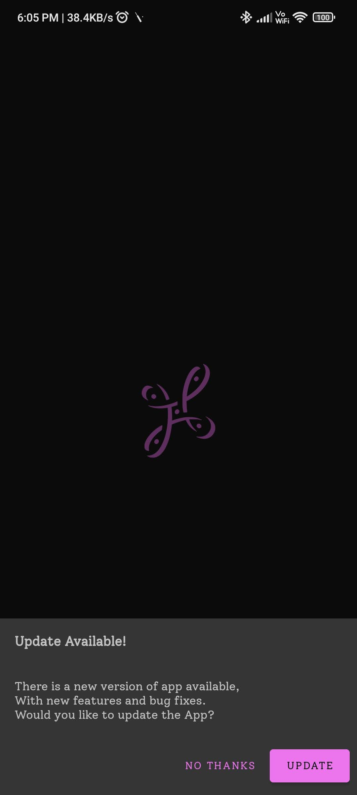
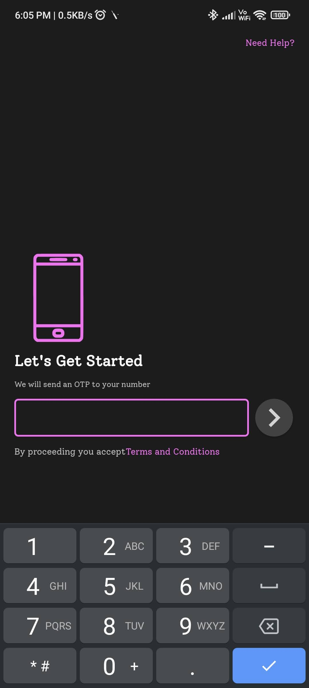
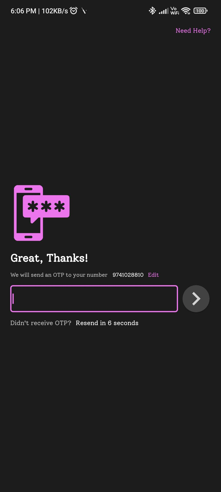
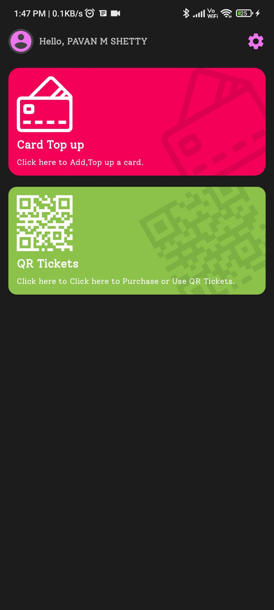
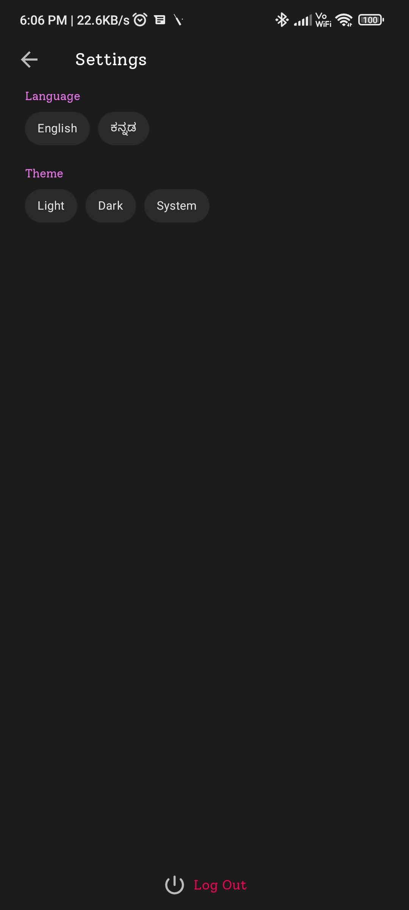
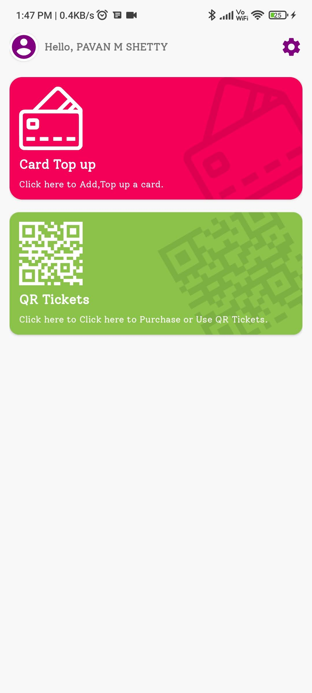
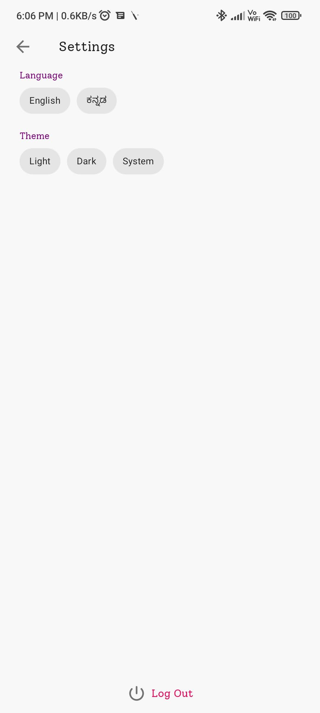

# NammaMetroMVVM
This is a practice project which is trying to build a app for metro user 
With following functionalities
  * User can Regiester
  * Allows user to add , see, recharge there metro card
  * User can purchase qr ticket or pass and use it in metro station without and human interaction.
 App is built in sucha a way that it can be used for any transportaion with minimum tweaks and configuration changes.
 
 Goal of this project is to practice the all new skills which i have learnt, build a app with clean code and follow good practices suggested by google.
 And build a app with good looking and user friendly UI/UX.
 
 ##  Features
 - [x] Splash screen
    - [x] App update
    - [x] Download configuration
    - [x] Check for registartion
    
 - [x] Login Screen
    - [x] Login
    - [ ] Auto fetch user phone number
    - [ ] Auto fetch OTP

 - [x] Settings screen
    - [x] Logout
    - [ ] Theme change
    - [ ] Language change

- [ ] Home Screen
- [ ] Card functionality
- [ ] Qr Ticket functionality

Around 25% of development has been completed.
    
 
 
## 📸 Screenshots

||||
|:----------------------------------------:|:-----------------------------------------:|:-----------------------------------------: |
|  |  |  |
|   |  |     |
|  

## Built With 🛠
- [Kotlin](https://kotlinlang.org/) - First class and official programming language for Android development.
- [Coroutines](https://kotlinlang.org/docs/reference/coroutines-overview.html) - For asynchronous and more..
- [Flow](https://kotlin.github.io/kotlinx.coroutines/kotlinx-coroutines-core/kotlinx.coroutines.flow/-flow/) - A cold asynchronous data stream that sequentially emits values and completes normally or with an exception.
- [Android Architecture Components](https://developer.android.com/topic/libraries/architecture) - Collection of libraries that help you design robust, testable, and maintainable apps.
  - [ViewModel](https://developer.android.com/topic/libraries/architecture/viewmodel) - Stores UI-related data that isn't destroyed on UI changes.
  - [ViewBinding](https://developer.android.com/topic/libraries/view-binding) - Generates a binding class for each XML layout file present in that module and allows you to more easily write code that interacts with views.
  - [DataStore](https://developer.android.com/topic/libraries/architecture/datastore) - Jetpack DataStore is a data storage solution that allows you to store key-value pairs or typed objects with protocol buffers.
- [Dependency Injection](https://developer.android.com/training/dependency-injection) -
  - [Hilt-Dagger](https://dagger.dev/hilt/) - Standard library to incorporate Dagger dependency injection into an Android application.
  - [Hilt-ViewModel](https://developer.android.com/training/dependency-injection/hilt-jetpack) - DI for injecting `ViewModel`.
- Backend
- [Retrofit](https://square.github.io/retrofit/) - A type-safe HTTP client for Android and Java.
- [GSON](https://github.com/google/gson) - A modern JSON library for Kotlin and Java.
- [GSON Converter](https://github.com/square/retrofit/tree/master/retrofit-converters/gson) - A Converter which uses Moshi for serialization to and from JSON.
- [Material Components for Android](https://github.com/material-components/material-components-android) - Modular and customizable Material Design UI components for Android.
- [Navigation Component](https://developer.android.com/guide/navigation) - Navigation refers to the interactions that allow users to navigate across, into, and back out from the different pieces of content within your app.
- [Live Data](https://developer.android.com/topic/libraries/architecture/livedata) - LiveData is an observable data holder class. Unlike a regular observable, LiveData is lifecycle-aware, meaning it respects the lifecycle of other app components, such as activities, fragments, or services. 

## Architecture
This app uses [***MVVM (Model View View-Model)***](https://developer.android.com/jetpack/docs/guide#recommended-app-arch) architecture.

## Contact 📩

 
